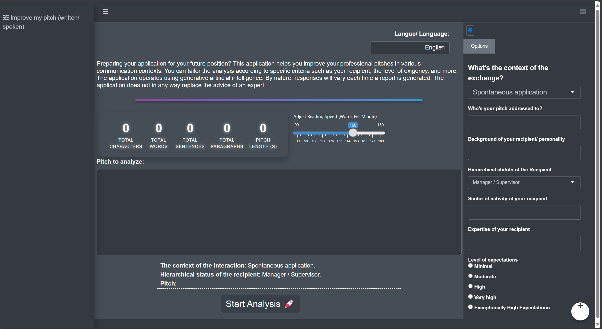

# anotherworkhub

<!-- badges: start -->
<!-- badges: end -->

`anotherworkhub` is a GEN-AI powered assistant designed to better understand and improve written text.

`anotherworkhub` relies on [Shiny app](https://en.wikipedia.org/wiki/Shiny_(software)) infrastructure and implements API calls to GPT models. Under the hood, `anotherworkhub` relies on packages such as [{golem}](https://engineering-shiny.org/golem.html), [{shinydashboard}](https://rstudio.github.io/shinydashboard/get_started.html), [{dplyr}](https://dplyr.tidyverse.org/) and [{shinymanager}](https://datastorm-open.github.io/shinymanager/).

This Shiny app is designed to help professionals **enhance their communication skills** through two powerful tools:

1. **Pitch Improver**: Refine your professional pitch with **real-time feedback** on structure, clarity, and grammar. Whether you're preparing for a presentation, networking event, or job application, this tool ensures your pitch is polished and effective.

2. **Interview Simulator**: Simulate realistic job interview scenarios with **interactive mock interviews**. Customize the format, questions, and settings to mirror your upcoming interviews, helping you practice and prepare with confidence.

With **multilingual support** for both French and English, as well as a range of customizable settings, this app is ideal for professionals seeking to **improve their communication skills** in both written and spoken formats.


**Note for Testers**: To explore the app, please use the following credentials:

Username: shiny_contest_user  
Password: 1234shiny!

## App preview



## Test the app

If you want to test the app but don't have access to a GPT account, [*hit me up*](https://www.linkedin.com/in/lgcruzsaavedra/) and I will give you access :)

## Installation

You can install the development version of `anotherworkhub` from [GitHub](https://github.com/) with:

```r
# install.packages("devtools")
devtools::install_github("AnotherDataGuy/anotherworkhub")
