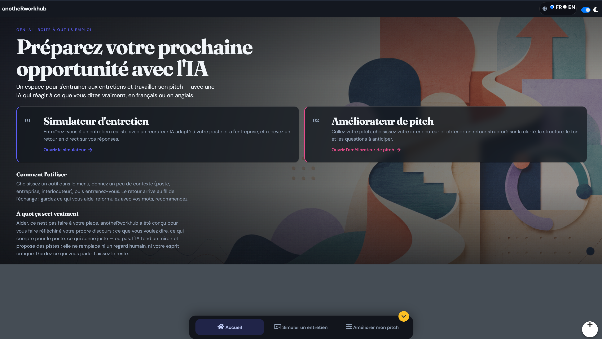
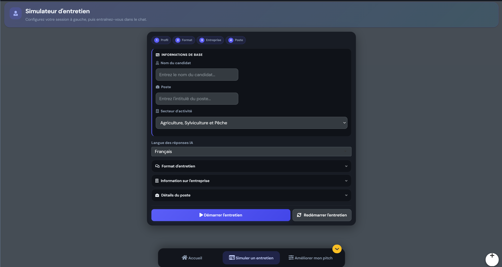
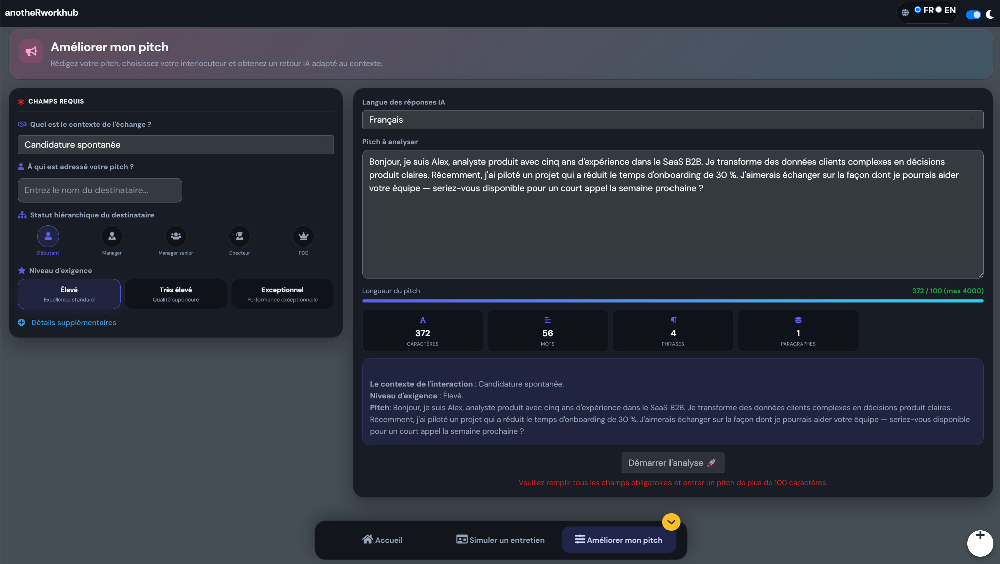

<!-- README.md is generated from README.Rmd. Please edit that file -->

# `{anotheRworkhub}`

[](https://lifecycle.r-lib.org/articles/stages.html#experimental)
[](https://www.gnu.org/licenses/gpl-3.0)
[](https://cran.r-project.org/)
[](https://app.codecov.io/gh/AnotherDataGuy/anotheRworkhub?branch=main)

A Shiny-powered platform designed to help job seekers ace their
interviews and perfect their professional communication using AI-powered
feedback and simulation.



## What is this package for?

`anotheRworkhub` lets you:  
- Practice interviews with an AI-powered interviewer  
- Improve professional pitches with detailed feedback  
- Work in both English and French  
- Get real-time analytics  
- Simulate different interview scenarios and contexts

### Interview Simulator

Practice interview skills in a safe environment:  
- Multiple interview formats  
- Customizable company contexts and positions  
- Real-time AI-powered responses  
- Cultural fit assessment



### Pitch Improver

Perfect professional pitch with comprehensive analysis:  
- Grammar and structure evaluation  
- Potential follow-up question prediction  
- Emotional tone analysis  
- Real-time statistics and timing



## Quick Setup

``` r
# Install the package
if (!require("devtools")) install.packages("devtools")
devtools::install_github("anotherdataguy/anotheRworkhub")

# Load and run
library(anotheRworkhub)
run_app()
```

### Prerequisites

- An OpenAI API key ([Get one here](https://platform.openai.com))
- R installed on your system
- Required environment variables:

``` r
  Sys.setenv(
    API_KEY = "your_api_key",
    shinymanagerauth = "your_auth_key"
  )
```

## Core packages

- {shiny} - [Web application
  framework](https://github.com/rstudio/shiny)  
- {bs4Dash} - [Bootstrap 4 dashboard
  components](https://bs4dash.rinterface.com/)  
- {golem} - [Framework for building production-grade Shiny
  apps](https://github.com/ThinkR-open/golem)  
- {shinyjs} - [JavaScript operations in
  Shiny](https://github.com/daattali/shinyjs)  
- {shinymanager} - [Authentication
  management](https://github.com/datastorm-open/shinymanager)  
- {promises} - [Promise-based asynchronous
  programming](https://rstudio.github.io/promises/)  
- {future} - [Parallel and distributed
  processing](https://future.futureverse.org/)

## License

This project is licensed under the GNU General Public License v3.0 - see
the [LICENSE](LICENSE) file for details.

## Note

- This application is currently under development, and features may
  change or evolve
- Using the OpenAI GPT API generates costs. Be mindful that you are
  responsible for any charges incurred from your usage
- Make sure to review OpenAI’s pricing model to avoid unexpected
  expenses
