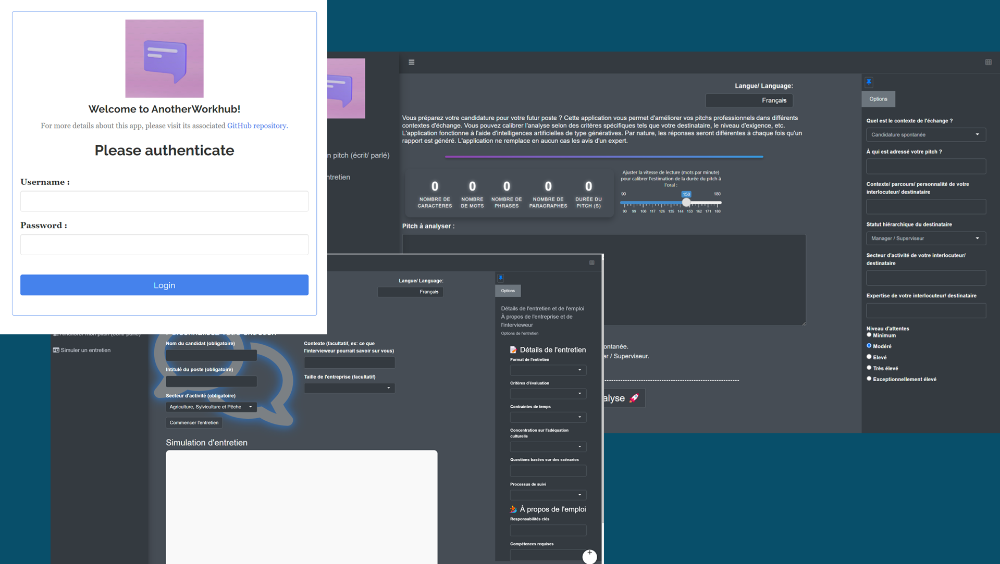

```{r, include = FALSE}
knitr::opts_chunk$set(
  collapse = TRUE,
  comment = "#>"
)
```

```{r setup, warning=FALSE}
library(anotherworkhub)
```

{anotherworkhub} is a Shiny application designed to assist professionals in improving their communication skills. By leveraging OpenAI’s GPT models, this app generates real-time feedback and simulates professional scenarios. It provides two main tools:

**Pitch Improver**: This tool helps users refine their professional pitches, offering feedback on structure, clarity, and grammar.
**Interview Simulator**: The simulator allows users to practice interview scenarios, providing an interactive experience with realistic questions and settings.

The app is designed for both English and French users, making it accessible for professionals from different language backgrounds.

## App preview  



## The app

**1. Pitch Improver**
The Pitch Improver allows users to input their professional pitches and receive detailed feedback. It assesses the overall structure, grammar, and clarity of the text and provides actionable suggestions for improvement.

**2. Interview Simulator**
The Interview Simulator offers a range of realistic scenarios for users to practice their interview skills. By using customized questions and formats, users can simulate various job interview settings to prepare for real-life situations.

The app relies on a solid infrastructure using several R packages:  
- **golem**: For Shiny app infrastructure and packaging.  
- **shinydashboard**: For creating interactive dashboards with a user-friendly layout.  
- **shinymanager**: For secure user authentication and session management.  
- **dplyr**: For data manipulation.  
- **httr**: For handling API calls to OpenAI’s GPT models.  
